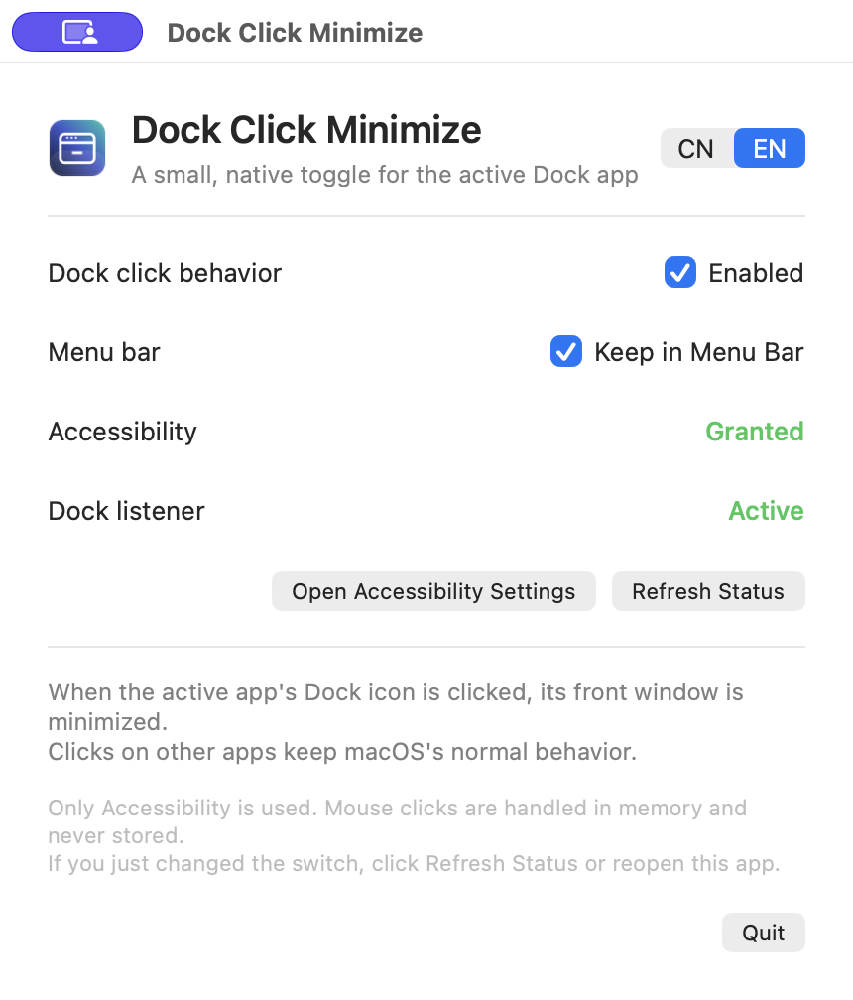
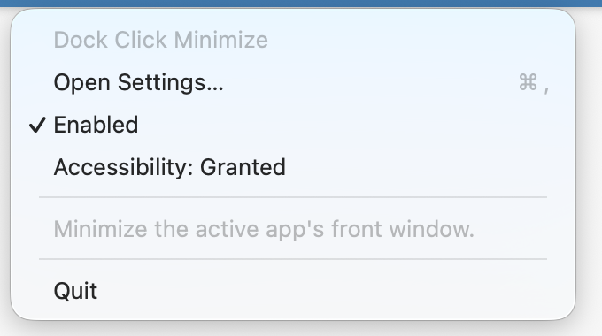

# Dock Click Minimize

English | [简体中文](README_CN.md)

Dock Click Minimize is a tiny, native macOS utility that adds a Windows-style Dock toggle:

- Click the Dock icon of the already frontmost app to minimize its front normal window.
- Click the same Dock icon again to let macOS restore it natively.
- Click another app to keep macOS's normal activation behavior.

It is written in Objective-C and built directly with Apple's Command Line Tools. There is no Xcode project, Electron, Node.js, Python runtime, WebView, third-party GUI framework, polling loop, or background daemon.

## Screenshots

The screenshots below show the real native settings window and menu bar menu. They are sanitized and contain no desktop content, file names, account names, or runtime data.

### Settings window



### Menu bar menu



## Download

Download the latest `DockClickMinimize-vX.Y.Z-macOS-arm64.zip` from [Releases](https://github.com/tmzw8cgfzr-oss/DockClickMinimize/releases/latest), unzip it, and move `DockClickMinimize.app` to `~/Applications` or `/Applications`.

The release is ad-hoc signed, not notarized with a paid Apple Developer certificate. If macOS blocks the first launch, Control-click the app, choose **Open**, and confirm once.

## Requirements

- macOS 13.0 or later
- Apple Silicon for the published arm64 release
- Accessibility permission

Only Accessibility is needed. The app does not request Input Monitoring, Screen Recording, Automation, or network access.

## Usage

1. Launch `DockClickMinimize.app`.
2. Open **System Settings → Privacy & Security → Accessibility**.
3. Enable the currently installed `DockClickMinimize.app` entry.
4. Use the settings window to enable or disable the Dock behavior.

The first launch opens a small native settings window. `Command-W` closes that window and keeps the listener running in the background; `Command-Q` quits the app. The optional menu bar item can reopen the settings window.

The settings window has a `CN / EN` switch in the upper-right corner. The default is `CN`, and the selection is saved locally. Settings, the application menu, and the menu bar menu follow the selected language.

## Behavior boundaries

The listener observes only `leftMouseDown` events through a session-level, listen-only `CGEventTap`. It never intercepts or stores input.

The app acts only when all of the following are true:

1. The clicked Dock item is an application, not Trash, a folder, a Stack, Launchpad, or a recent item.
2. The clicked application matches the current frontmost application by Bundle ID.
3. The app has one eligible normal window.
4. The window is not already minimized and is not full screen.

The original click is always passed through to the Dock. No action is taken for background apps, apps without a normal window, minimized windows, full-screen windows, or modified clicks.

## Build from source

Install Apple's Command Line Tools if needed:

```sh
xcode-select --install
```

Build without Xcode:

```sh
./build.sh
```

Install the verified build into the current user's Applications folder:

```sh
./build.sh install
open "$HOME/Applications/DockClickMinimize.app"
```

The build uses `clang`, `AppKit.framework`, `ApplicationServices.framework`, and `CoreGraphics.framework`. The `ARCH` environment variable can be used for a source build of another architecture, for example `ARCH=x86_64 ./build.sh`.

## Project layout

```text
DockClickMinimize/
├── main.m
├── DockMonitor.m
├── DockMonitor.h
├── build.sh
├── Info.plist
├── docs/images/
│   ├── settings-en.png
│   ├── settings-cn.png
│   ├── menu-en.png
│   └── menu-cn.png
└── README.md
```

The menu bar menu is created only when its icon is clicked and released after it closes, keeping the idle process small. On the author's Apple Silicon test machine, the installed app is about 1.3 MB and idles around 31 MB physical footprint with the menu bar icon enabled.

## Icon and implementation

The bundled Dock icon is an independent redraw in the style of the open-source window-minimize icon from [Tabler Icons](https://tabler.io/icons). Tabler Icons is MIT-licensed ([license](https://github.com/tabler/tabler-icons/blob/main/LICENSE)); no third-party library is linked at runtime.

The implementation is independent and does not copy code from other projects. The Dock hit-test and window operations use public macOS Accessibility and Core Graphics APIs.

## License

No project license file has been added yet. Public visibility does not by itself grant broad reuse rights; add a license if you want to define how others may use, modify, and redistribute the source.
